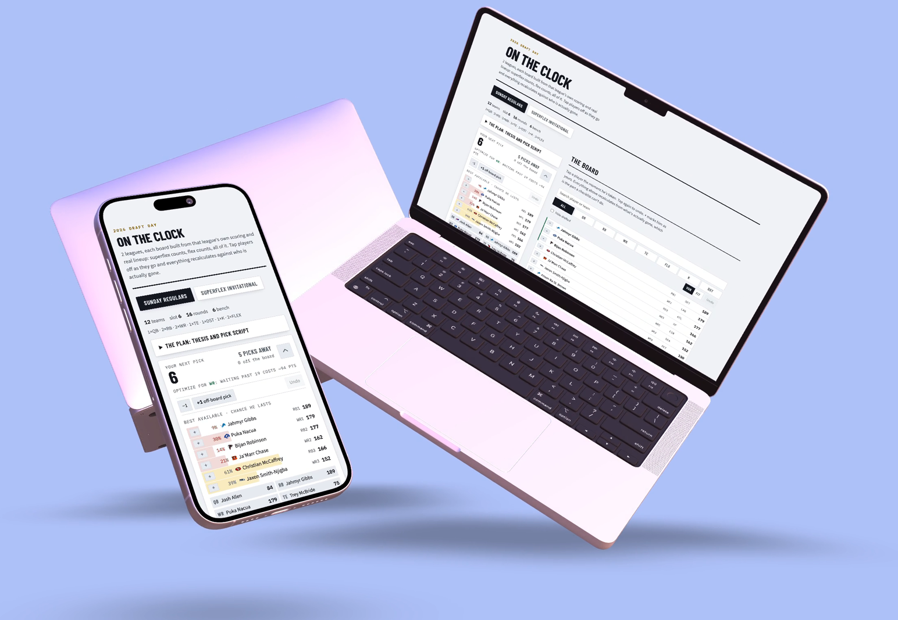
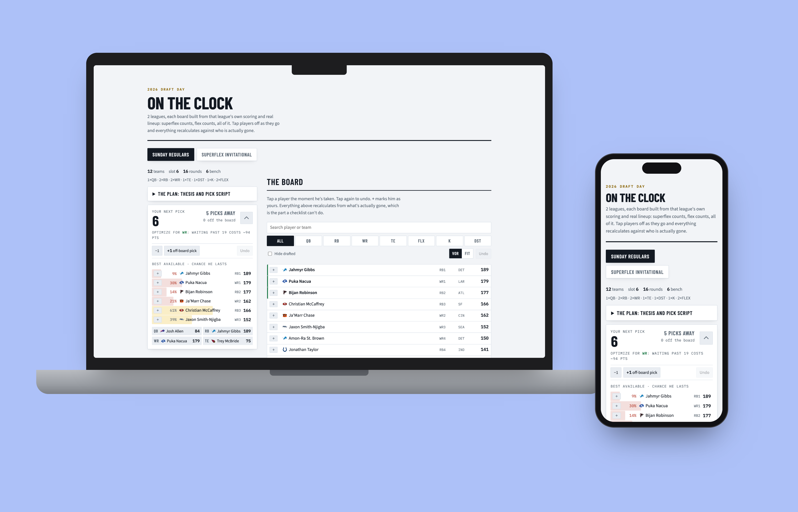

# On the Clock

A fantasy football draft board that is built from **your league's actual rules**:
its scoring, its lineup (superflex counts, flex counts, all of it), the number of
teams, your pick slot, and then recalculates on your phone as players come off the
board.

**Live demo:** [davemaynard.github.io/on-the-clock](https://davemaynard.github.io/on-the-clock/)

<p align="center">
  
</p>

It reads an ESPN league, computes every player's value over replacement for *that*
roster shape, prices the cost of waiting a round at each position from public ADP,
and renders one static HTML page you keep open during the draft. Tap players off as
they go; every number updates against who is actually gone. With `serve` running it
also follows the live ESPN draft feed, so the board keeps up on its own.

## What it does

- **VOR against your lineup.** Replacement level is derived from the league's real
  starting slots and flex families, not a generic 12-team PPR assumption. A superflex
  room moves the whole QB tier up; a two-flex room thins RB. The board knows.
- **Cost of waiting.** For your next pick, the chance each player lasts and what it
  costs (in projected points) to wait one more round at each position, from Fantasy
  Football Calculator's ADP distribution.
- **Your calls, layered on top.** A `marks.toml` of targets, fades, news alerts,
  re-priced projections and a per-league pick script. They show up as chips and a
  plan rail; the math underneath doesn't change.
- **Phone-first tracker.** The page is self-contained (state in `localStorage`),
  works offline, and stays legible at 390px. Undo, off-board picks, position filters,
  a roster panel.
- **Live sync.** `on-the-clock serve` polls ESPN's draft detail and pushes picks to
  the page, including a random draft order the moment it's published.
- **Pick-slot simulator.** Before the draft order is set, `sim` Monte-Carlos the
  draft from every slot to tell you which one to hope for.

## Try it without a league

```sh
uv run on-the-clock demo --serve
```

Writes `out/demo.html` from a bundled fixture (two invented leagues, a 12-team PPR
room and a superflex room, over a real late-August snapshot of ESPN projections and
FFC ADP) and serves it on <http://localhost:8777>. Team names are made up; the
players are real. The team marks and the projection snapshot are ESPN's, cached for
the demo only, and are not covered by this repo's MIT license.

That command produces this:

<p align="center">
  
</p>

## Use it with your league

Everything personal lives in a working directory, never in the package:

```
my-draft/
  .env            ESPN_S2 / ESPN_SWID cookies (private leagues only)
  leagues.toml    which leagues, your pick slot
  marks.toml      your targets, fades, alerts, pick script (optional)
  data/raw/       cached ESPN pulls and ADP snapshots
  out/            the rendered board
```

```sh
uv tool install git+https://github.com/davemaynard/on-the-clock   # puts `on-the-clock` on PATH

mkdir my-draft && cd my-draft
# Create .env, leagues.toml and (optionally) marks.toml from the three example files
# at the top of this repo; each is a few commented lines.

on-the-clock adp                # pull FFC ADP (ppr + 2qb)
on-the-clock build              # pull ESPN, build out/board.html
on-the-clock serve              # serve it + live ESPN sync on :8777
```

Other commands: `board` (a markdown VOR table for one league), `plan` (round-by-round
plan for a slot), `sim` (pick-slot Monte Carlo), `league` (dump a league's settings
and rosters to markdown). `on-the-clock` with no arguments lists them.

Set `ON_THE_CLOCK_DIR` to point at the working directory from anywhere.

### The cookies

Private ESPN leagues need `ESPN_S2` and `ESPN_SWID` from a logged-in browser
(DevTools, Application, Cookies, espn.com). Public leagues work without them. The
`.env` file is gitignored; nothing in this repo ever contains them.

## How it's built

Python does the thinking; the browser draws the board.

- `on_the_clock/` reads ESPN, computes VOR and the cost of waiting, and renders one
  self-contained HTML page: the shell, the stylesheet, a 32-image team-mark sheet, the
  data as `window.ON_THE_CLOCK`, and the bundle that renders it.
- `web/src/` is a Preact app in TypeScript, one component per piece of the page with
  its own CSS module beside it: `app/` (masthead, league tabs, footer), `league/` (the draft room,
  the plan rail, the pre-draft tables, and the hooks that own state), `assistant/`
  (next pick, best available, roster), `board/` (tools, rows, the rescue code) and
  `player/` (name, tag, team mark). `styles/` holds the tokens, the element defaults
  and the primitives the modules extend with `composes`. `model/` is the draft math as
  pure functions, tested on their own, and `model/types.ts` is the data contract the
  Python side writes into the page.
- `npm run build` is esbuild alone: TypeScript, JSX and CSS modules are built in, so the
  whole thing bundles into `on_the_clock/assets/`, which is committed so installing from
  GitHub needs no Node. Types are checked by `tsc`, not the bundler. CI fails if the
  assets are stale.

## Development

```sh
uv sync && npm install
uv run pytest                  # the Python side; renders the demo fixture end to end
uv run ruff check .
npm test                       # the draft model and the live-feed merge, then the
                               # rendered demo in Chrome at phone, tablet and desktop
                               # widths, light and dark: geometry and computed style
npm run check                  # Biome (format, lint) and tsc (types) over web/
npm run build                  # web/src -> on_the_clock/assets/ (commit the result)
uv run on-the-clock demo --out docs/index.html
uv run on-the-clock demo --out out/demo.html && node web/screenshots.ts
                               # refresh the live demo page, then the README images
```

## Status

Working and used for real drafts. Carved out of a private repo in September 2026 with
fresh history; the private version ran the 2026 drafts. Phone-first, with a two-column draft room from
64rem up (assistant and roster pinned on the left, the board on the right), light
and dark, team marks inlined from a 32-image sheet so the page stays one request.
Player headshots are deliberately left out: 260 inlined portraits would triple the
page for a face you already know.

## License

MIT
