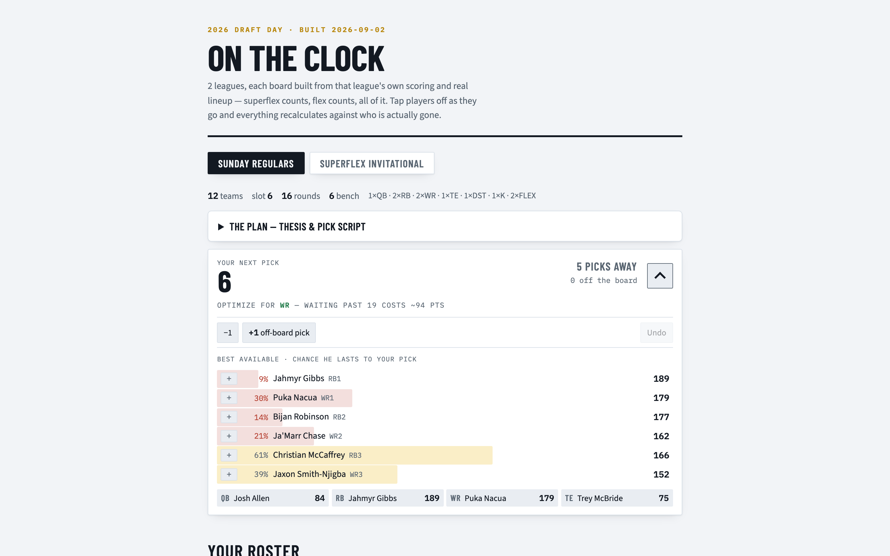

# On the Clock

A fantasy football draft board that is built from **your league's actual rules** —
its scoring, its lineup (superflex counts, flex counts, all of it), the number of
teams, your pick slot — and then recalculates on your phone as players come off the
board.



It reads an ESPN league, computes every player's value over replacement for *that*
roster shape, prices the cost of waiting a round at each position from public ADP,
and renders one static HTML page you keep open during the draft. Tap players off as
they go; every number updates against who is actually gone. With `serve` running it
also follows the live ESPN draft feed, so the board keeps up on its own.

## What it does

- **VOR against your lineup.** Replacement level is derived from the league's real
  starting slots and flex families, not a generic 12-team PPR assumption. A superflex
  room moves the whole QB tier up; a two-flex room thins RB — the board knows.
- **Cost of waiting.** For your next pick, the chance each player lasts and what it
  costs (in projected points) to wait one more round at each position, from Fantasy
  Football Calculator's ADP distribution.
- **Your calls, layered on top.** A `marks.toml` of targets, fades, news alerts,
  re-priced projections and a per-league pick script. They show up as chips and a
  plan rail; the math underneath doesn't change.
- **Phone-first tracker.** The page is self-contained (state in `localStorage`),
  works offline, and stays legible at 390px. Undo, off-board picks, position filters,
  a roster panel.
- **Live sync.** `on-the-clock serve` polls ESPN's draft detail and pushes picks to
  the page, including a random draft order the moment it's published.
- **Pick-slot simulator.** Before the draft order is set, `sim` Monte-Carlos the
  draft from every slot to tell you which one to hope for.

## Try it without a league

```sh
uv run on-the-clock demo --serve
```

Writes `out/demo.html` from a bundled fixture — two invented leagues (a 12-team PPR
room and a superflex room) over a real late-August snapshot of ESPN projections and
FFC ADP — and serves it on <http://localhost:8777>. Team names are made up; the
players are real.

## Use it with your league

Everything personal lives in a working directory, never in the package:

```
my-draft/
  .env            ESPN_S2 / ESPN_SWID cookies (private leagues only)
  leagues.toml    which leagues, your pick slot
  marks.toml      your targets, fades, alerts, pick script (optional)
  data/raw/       cached ESPN pulls and ADP snapshots
  out/            the rendered board
```

```sh
uv tool install git+https://github.com/davemaynard/on-the-clock   # puts `on-the-clock` on PATH

cd my-draft
cp /path/to/on-the-clock/.env.example .env               # fill in the cookies
cp /path/to/on-the-clock/leagues.example.toml leagues.toml
cp /path/to/on-the-clock/marks.example.toml marks.toml   # optional

on-the-clock adp                # pull FFC ADP (ppr + 2qb)
on-the-clock build              # pull ESPN, build out/board.html
on-the-clock serve              # serve it + live ESPN sync on :8777
```

Other commands: `board` (a markdown VOR table for one league), `plan` (round-by-round
plan for a slot), `sim` (pick-slot Monte Carlo), `league` (dump a league's settings
and rosters to markdown). `on-the-clock` with no arguments lists them.

Set `ON_THE_CLOCK_DIR` to point at the working directory from anywhere.

### The cookies

Private ESPN leagues need `ESPN_S2` and `ESPN_SWID` from a logged-in browser
(DevTools → Application → Cookies → espn.com). Public leagues work without them. The
`.env` file is gitignored; nothing in this repo ever contains them.

## Development

```sh
uv sync
uv run pytest
uv run ruff check .
```

The tests render the demo fixture end to end, so a rendering regression fails there
first.

## Status

Working and used for real drafts. The visual layer is functional rather than
finished — a design pass (tokens, player headshots and team logos via `images.py`,
layout at tablet widths) is the next milestone.

## License

MIT
